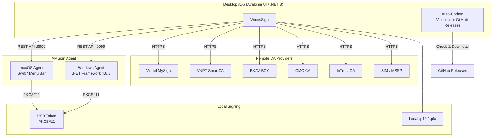
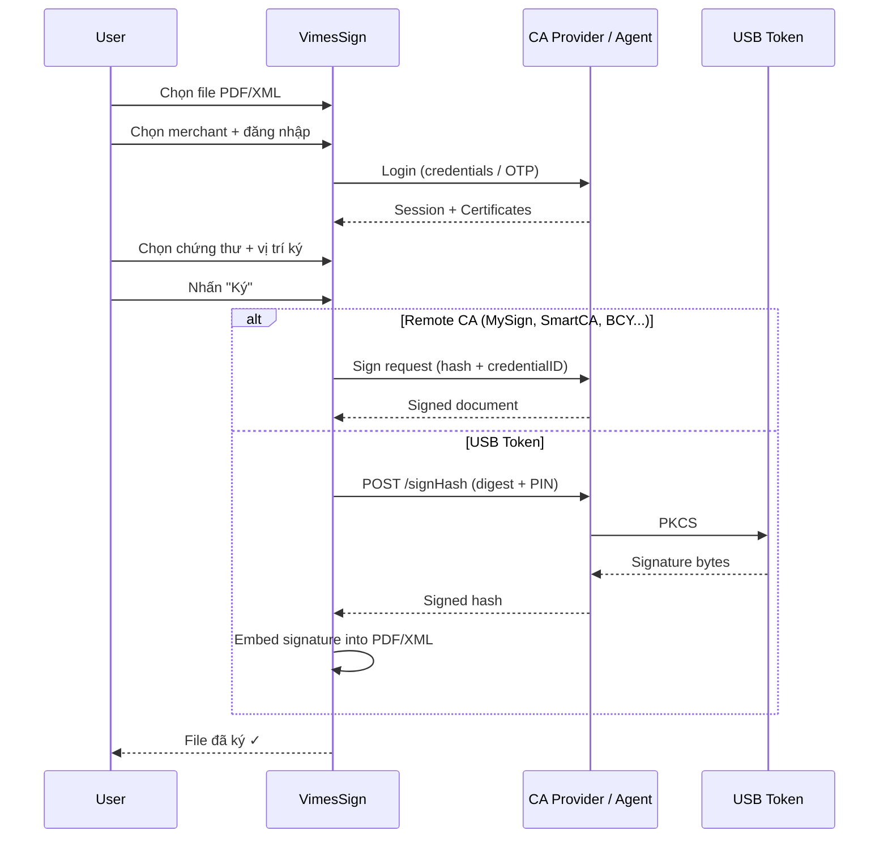
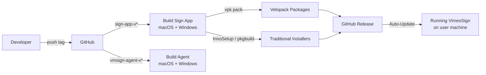

# VN Sign Sample

Bộ ứng dụng ký số đa nền tảng (macOS + Windows) cho USB Token, chữ ký số đám mây và chữ ký số cục bộ.

## Kiến trúc hệ thống



## Luồng ký số (Signing Flow)



## Quy trình CI/CD & Auto-Update



## Cấu trúc dự án

```
vn-sign-sample/
├── sign-app/                    ← Ứng dụng ký số (Avalonia UI, cross-platform)
├── vmsign-agent/
│   ├── mac/                     ← Agent macOS (Swift native, menu bar)
│   └── win/                     ← Agent Windows (.NET Framework 4.6.1)
├── mqtt/                        ← MQTT Broker cho ký số từ xa (Docker)
├── docs/                        ← Ảnh chụp màn hình, tài liệu
└── .github/workflows/           ← CI/CD (GitHub Actions)
```

## Các nhà cung cấp hỗ trợ

| Merchant | Loại | Mô tả |
|----------|------|-------|
| **MySign** | Remote CA | Ký số đám mây Viettel MySign |
| **SmartCA** | Remote CA | Ký số đám mây VNPT SmartCA |
| **BCY** | Remote CA | Ký số đám mây BKAV (Ban Cơ Yếu) |
| **CMC** | Remote CA | Ký số đám mây CMC CA |
| **InTrust** | Remote CA | Ký số đám mây InTrust CA |
| **SIM** | Remote CA | Ký số qua SIM/MSSP (OTP SMS) |
| **USB** | Local | Ký số bằng USB Token / Smart Card qua PKCS#11 |
| **Self** | Local | Ký số bằng file chứng thư cục bộ (.p12 / .pfx) |

## Tính năng chính

- **Ký PDF**: Ký số có hình ảnh, vị trí tùy chỉnh bằng kéo thả trên preview
- **Ký XML**: Hỗ trợ Học Bạ (NEAC), Lý Lịch, Tổng Kết — phân tích tự động document type
- **Ký hàng loạt**: Ký nhiều file PDF cùng lúc
- **USB Token**: Tích hợp VMSignAgent để ký trực tiếp từ phần cứng PKCS#11

## Cài đặt nhanh

### Người dùng cuối

Tải bộ cài từ [Releases](https://github.com/vimesjscvn/vn-sign-sample/releases):

| Nền tảng | File | Mô tả |
|----------|------|-------|
| macOS (arm64) | `VimesSign-mac-arm64-*.pkg` | Cài cả VimesSign + VMSignAgent |
| Windows (x64) | `VimesSign-win-x64-*-setup.exe` | Trình cài đặt InnoSetup |

### Lập trình viên

```bash
git clone https://github.com/vimesjscvn/vn-sign-sample.git
cd vn-sign-sample

# Chạy ứng dụng ký số
cp sign-app/appsettings.example.json sign-app/appsettings.json
# (Chỉnh sửa appsettings.json với thông tin merchant)
dotnet run --project sign-app/VMSign.csproj

# Build VMSign Agent (macOS)
cd vmsign-agent/mac && swift build -c release

# Build VMSign Agent (Windows)
cd vmsign-agent/win && dotnet build -c Release
```

## CI/CD

| Workflow | Trigger | Mô tả |
|----------|---------|--------|
| `build-sign-app.yml` | `sign-app-v*.*.*` | Build VimesSign + VMSignAgent cho cả macOS (.pkg) và Windows (.exe) |
| `build-vmsign-agent-mac.yml` | `vmsign-agent-v*.*.*` | Build VMSignAgent standalone macOS .pkg |
| `build-vmsign-agent-win.yml` | `vmsign-agent-v*.*.*` | Build VMSignAgent standalone Windows .zip + .exe |

## Tài liệu chi tiết

- [sign-app/README.md](sign-app/README.md) — Hướng dẫn ứng dụng ký số
- [vmsign-agent/mac/README.md](vmsign-agent/mac/README.md) — Agent macOS
- [vmsign-agent/win/README.md](vmsign-agent/win/README.md) — Agent Windows
- [mqtt/README.md](mqtt/README.md) — MQTT Broker cho ký từ xa

## Phiên bản SDK

Sử dụng [Vimes SignSDK](https://www.nuget.org/packages/Vimes.SignSDK/) `1.0.23` từ NuGet.org.
