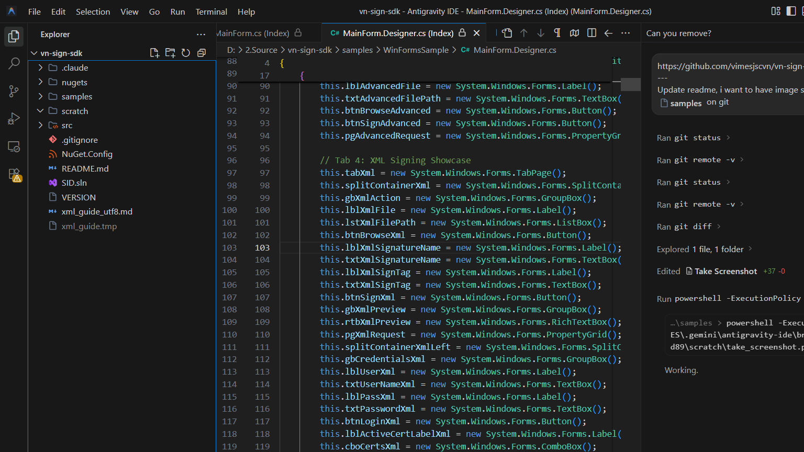
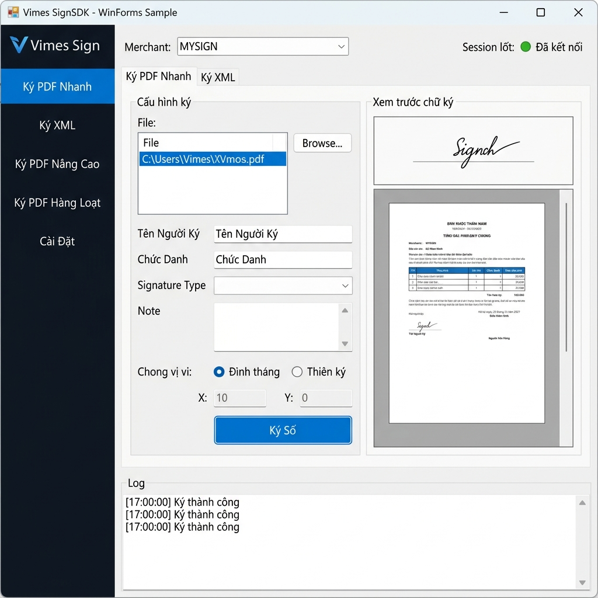

# Hướng Dẫn Sử Dụng WinFormsSample - Vimes SignSDK

Mẫu ứng dụng Windows Forms này minh họa cách tích hợp và sử dụng bộ thư viện **Vimes SignSDK** để ký số tài liệu PDF bằng nhiều hình thức khác nhau bao gồm:
*   **Remote CA (Cloud CA)**: Viettel MySign, VNPT SmartCA, BKAV, CMC, v.v...
*   **Local CA / USB Token**: Ký số bằng USB Token hoặc file chứng thư số (.p12, .pfx) cục bộ.
*   **Thiết lập vị trí và ghi chú (Note)**: Hỗ trợ người dùng kéo thả, di chuyển và tùy biến ghi chú đính kèm chữ ký.



---

## Giao Diện Ứng Dụng



> Giao diện chính của ứng dụng mẫu với sidebar điều hướng, header chọn Merchant, bảng cấu hình ký số và khu vực nhật ký (log).

---

## 1. Yêu Cầu Hệ Thống

*   **.NET 9.0 SDK** trở lên.
*   Hệ điều hành Windows (hỗ trợ Windows Forms).
*   Visual Studio 2022 hoặc VS Code hỗ trợ C# / .NET.

---

## 2. Hướng Dẫn Cấu Hình `appsettings.json`

Trước khi chạy ứng dụng, bạn cần cấu hình thông tin tài khoản ký số của đơn vị mình trong file `appsettings.json`. Hãy thay thế các phần nằm trong dấu ngoặc vuông `[...]` bằng thông tin thực tế:

```json
{
  "AppSettings": {
    "TerminalSetting": {
      "BaseUrl": "https://mpki2.ca.gov.vn/mpki/v2/",
      "RelyingParty": "[TÊN_RELYING_PARTY_CỦA_BẠN]",
      "RelyingPartyUser": "[USER_RELYING_PARTY]",
      "RelyingPartyPassword": "[MẬT_KHẨU_RELYING_PARTY]",
      "RelyingPartySignature": "[CHỮ_KÝ_RELYING_PARTY_MÃ_HÓA_BASE64]",
      "RelyingPartyKeyStore": "[FILE_CHỨNG_THƯ].p12",
      "RelyingPartyKeyStorePassword": "[MẬT_KHẨU_CHỨNG_THƯ_P12]"
    },
    "MySignSetting": {
      "BaseUrl": "https://remotesigning.viettel.vn",
      "ProfileId": "[RAS_PROFILE_ID_VIETTEL]",
      "ClientId": "[CLIENT_ID_MYSIGN]",
      "ClientSecret": "[CLIENT_SECRET_MYSIGN]"
    },
    "SmartCASetting": {
      "BaseUrl": "https://gwsca.vnpt.vn",
      "ProfileId": "[RAS_PROFILE_ID_VNPT]",
      "ClientId": "[CLIENT_ID_SMARTCA]",
      "ClientSecret": "[CLIENT_SECRET_SMARTCA]"
    }
  }
}
```

> [!IMPORTANT]
> Không commit các thông tin mật khẩu, ClientSecret, hoặc API Key thực tế lên các repository công khai như GitHub.

---

## 3. Khôi Phục NuGet Packages

Ứng dụng mẫu này sử dụng các package được phát hành trên registry **nuget.org**:
*   `Vimes.SignSDK`
*   `Vimes.SignSDK.ViewModels`
*   `Vimes.SignSDK.Merchants.MySign`
*   `Vimes.SignSDK.Merchants.SmartCA`
*   ... và các thư viện hỗ trợ tương ứng.

Bạn có thể khôi phục package thông qua Visual Studio (chọn **Restore NuGet Packages**) hoặc chạy lệnh sau trong Terminal tại thư mục `WinFormsSample`:

```bash
dotnet restore
```

---

## 4. Hướng Dẫn Chạy & Sử Dụng

1.  Mở solution `WinFormsSample.sln` bằng Visual Studio 2022.
2.  Chạy ứng dụng bằng cách nhấn **F5** (hoặc nhấn nút **Start**).
3.  **Ký qua Cloud CA (Viettel MySign, VNPT SmartCA...)**:
    *   Chọn Merchant tương ứng trên giao diện ứng dụng.
    *   Nhập **Số điện thoại/Tên đăng nhập** và **Mật khẩu/Mã PIN** tài khoản của bạn.
    *   Nhấp **Đăng Nhập** để lấy danh sách chứng thư số có sẵn.
    *   Chọn file PDF cần ký, tùy chọn vị trí hiển thị chữ ký trên tài liệu và bấm **Ký Số**.
4.  **Ký qua Local CA / USB Token**:
    *   Chọn Merchant là **LOCAL** hoặc **USB**.
    *   Chọn file chứng thư `.p12` hoặc thiết bị USB Token được kết nối.
    *   Nhập mật khẩu/Mã PIN và thực hiện ký tài liệu trực tiếp.

---

## 5. Tùy Chọn Vị Trí Ghi Chú (Note Placement)

Ứng dụng có tích hợp cơ chế cấu hình loại chữ ký và ghi chú:
*   Chọn loại chữ ký là `Ghi chú` (`SignatureType.NOTE`).
*   Bạn có thể nhập tọa độ X, Y hoặc sử dụng giao diện trực quan trực tiếp trên PDF Viewer để xác định vùng vẽ ghi chú cho người dùng cuối.
