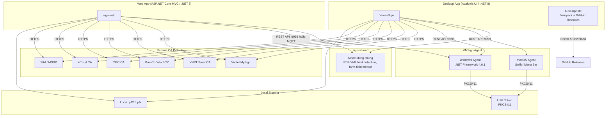
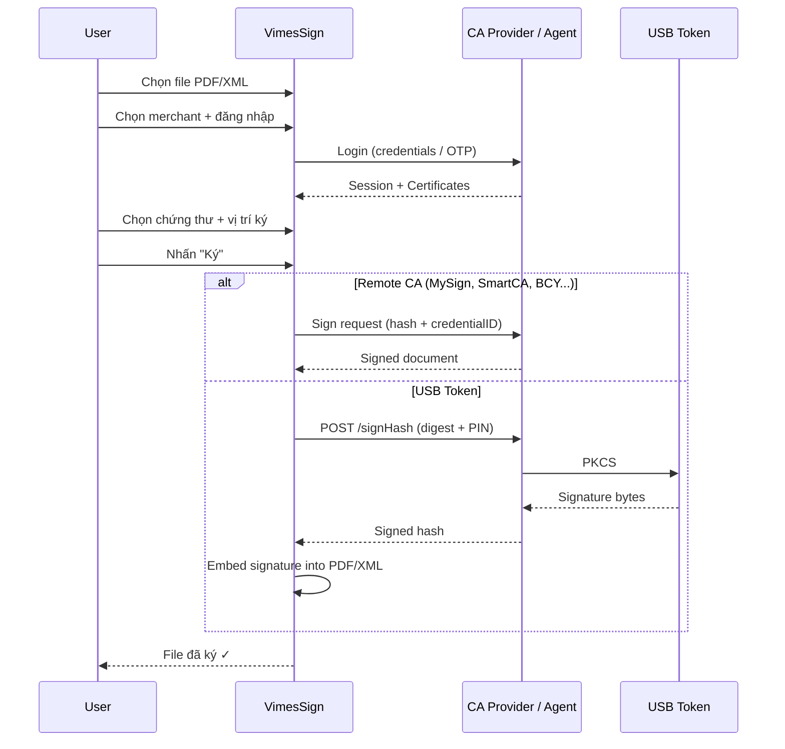
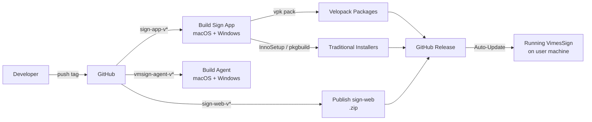

# VN Sign Sample

Bộ ứng dụng ký số đa nền tảng — **desktop** (macOS + Windows, Avalonia) và **web** (ASP.NET Core MVC) — cho USB Token, chữ ký số đám mây và chữ ký số cục bộ. Cả hai front-end dùng chung một tầng gọi SDK (`Vimes.SignSDK` trên NuGet.org) nên hành vi ký và danh sách merchant hỗ trợ giống hệt nhau.

## Kiến trúc hệ thống


```mermaid
graph TB
    subgraph "Desktop App (Avalonia UI / .NET 8)"
        SignApp[VimesSign]
        AutoUpdate[Auto-Update<br/>Velopack + GitHub Releases]
    end

    subgraph "Web App (ASP.NET Core MVC / .NET 8)"
        SignWeb[sign-web]
    end

    subgraph "sign-shared"
        Shared[Model dùng chung<br/>PDF/XML field detection, form-field creator]
    end

    subgraph "VMSign Agent"
        AgentMac[macOS Agent<br/>Swift / Menu Bar]
        AgentWin[Windows Agent<br/>.NET Framework 4.6.1]
    end

    subgraph "Remote CA Providers"
        MySign[Viettel MySign]
        SmartCA[VNPT SmartCA]
        BCY[Ban Cơ Yếu BCY]
        CMC[CMC CA]
        InTrust[InTrust CA]
        SIM[SIM / MSSP]
    end

    subgraph "Local Signing"
        USB[USB Token<br/>PKCS#11]
        SelfCert[Local .p12 / .pfx]
    end

    SignApp --> Shared
    SignWeb --> Shared
    SignApp -->|REST API :9999| AgentMac
    SignApp -->|REST API :9999| AgentWin
    SignWeb -->|REST API :9999 hoặc MQTT| AgentWin
    AgentMac -->|PKCS#11| USB
    AgentWin -->|PKCS#11| USB
    SignApp -->|HTTPS| MySign
    SignApp -->|HTTPS| SmartCA
    SignApp -->|HTTPS| BCY
    SignApp -->|HTTPS| CMC
    SignApp -->|HTTPS| InTrust
    SignApp -->|HTTPS| SIM
    SignApp --> SelfCert
    SignWeb -->|HTTPS| MySign
    SignWeb -->|HTTPS| SmartCA
    SignWeb -->|HTTPS| BCY
    SignWeb -->|HTTPS| CMC
    SignWeb -->|HTTPS| InTrust
    SignWeb -->|HTTPS| SIM
    SignWeb --> SelfCert
    AutoUpdate -->|Check & Download| GH[GitHub Releases]
```

## Luồng ký số (Signing Flow)


```mermaid
sequenceDiagram
    participant User
    participant VimesSign
    participant Merchant as CA Provider / Agent
    participant Token as USB Token

    User->>VimesSign: Chọn file PDF/XML
    User->>VimesSign: Chọn merchant + đăng nhập
    VimesSign->>Merchant: Login (credentials / OTP)
    Merchant-->>VimesSign: Session + Certificates

    User->>VimesSign: Chọn chứng thư + vị trí ký
    User->>VimesSign: Nhấn "Ký"

    alt Remote CA (MySign, SmartCA, BCY...)
        VimesSign->>Merchant: Sign request (hash + credentialID)
        Merchant-->>VimesSign: Signed document
    else USB Token
        VimesSign->>Merchant: POST /signHash (digest + PIN)
        Merchant->>Token: PKCS#11 C_Sign()
        Token-->>Merchant: Signature bytes
        Merchant-->>VimesSign: Signed hash
        VimesSign->>VimesSign: Embed signature into PDF/XML
    end

    VimesSign-->>User: File đã ký ✓
```

## Quy trình CI/CD & Auto-Update


```mermaid
graph LR
    Dev[Developer] -->|push tag| GH[GitHub]
    GH -->|sign-app-v*| WF1[Build Sign App<br/>macOS + Windows]
    GH -->|sign-web-v*| WF3[Publish sign-web<br/>.zip]
    GH -->|vmsign-agent-v*| WF2[Build Agent<br/>macOS + Windows]

    WF1 -->|vpk pack| VP[Velopack Packages]
    WF1 -->|InnoSetup / pkgbuild| Installer[Traditional Installers]
    VP --> Release[GitHub Release]
    Installer --> Release
    WF3 --> Release

    Release -->|Auto-Update| App[Running VimesSign<br/>on user machine]
```

## Cấu trúc dự án

```
vn-sign-sample/
├── sign-app/                    ← Ứng dụng desktop (Avalonia UI, cross-platform)
├── sign-web/                    ← Ứng dụng web (ASP.NET Core MVC, .NET 8)
├── sign-shared/                 ← Model/service dùng chung giữa sign-app và sign-web
│                                   (PDF/XML field detection, text-search field creator)
├── sign-app-e2e/                ← Test E2E cho sign-app (FlaUI, điều khiển UI Avalonia thật)
├── sign-web-e2e/                ← Test E2E cho sign-web
├── vmsign-agent/
│   ├── mac/                     ← Agent macOS (Swift native, menu bar)
│   └── win/                     ← Agent Windows (.NET Framework 4.6.1)
├── mqtt/                        ← MQTT Broker cho ký số từ xa (Docker)
├── docs/                        ← Ảnh chụp màn hình, tài liệu
└── .github/workflows/           ← CI/CD (GitHub Actions)
```

## Các nhà cung cấp hỗ trợ

| Merchant | Loại | Mô tả |
|----------|------|-------|
| **MySign** | Remote CA | Ký số đám mây Viettel MySign |
| **SmartCA** | Remote CA | Ký số đám mây VNPT SmartCA |
| **BCY** | Remote CA | Ký số đám mây BKAV (Ban Cơ Yếu) |
| **CMC** | Remote CA | Ký số đám mây CMC CA |
| **InTrust** | Remote CA | Ký số đám mây InTrust CA |
| **SIM** | Remote CA | Ký số qua SIM/MSSP (OTP SMS) |
| **USB** | Local | Ký số bằng USB Token / Smart Card qua PKCS#11 |
| **Self** | Local | Ký số bằng file chứng thư cục bộ (.p12 / .pfx) |

## Tính năng chính

Có ở cả sign-app (desktop) và sign-web (trình duyệt) — UI/UX được giữ đồng bộ giữa hai bên:

- **Ký PDF**: chữ ký có hình ảnh, vị trí tùy chỉnh bằng vẽ ô hoặc AcroField có sẵn trên preview
- **Ký XML**: hỗ trợ Học Bạ (NEAC), Lý Lịch, Tổng Kết — tự động phân tích document type và gợi ý SignTag/ParentXPath/ReferenceId
- **Ký hàng loạt**: ký nhiều file PDF cùng lúc bằng chứng thư Self CA (.p12/.pfx)
- **Cài đặt theo phiên**: mỗi merchant (MySign, SmartCA, BCY, CMC, InTrust, SIM, USB) có panel cấu hình + nút kiểm tra kết nối riêng, lưu theo session mà không cần khởi động lại server
- **USB Token**: tích hợp VMSignAgent (macOS/Windows) để ký trực tiếp từ phần cứng qua PKCS#11, có bỏ qua hộp thoại nhập PIN của driver bằng cách đăng nhập PKCS#11 trực tiếp

## Cài đặt nhanh

### Người dùng cuối

Tải bộ cài từ [Releases](https://github.com/vimesjscvn/vn-sign-sample/releases):

| Nền tảng | File | Mô tả |
|----------|------|-------|
| macOS (arm64) | `VimesSign-mac-arm64-*.pkg` | Cài cả VimesSign + VMSignAgent |
| Windows (x64) | `VimesSign-win-x64-*-setup.exe` | Trình cài đặt InnoSetup |

### Lập trình viên

```bash
git clone https://github.com/vimesjscvn/vn-sign-sample.git
cd vn-sign-sample

# Chạy ứng dụng desktop (sign-app)
cp sign-app/appsettings.example.json sign-app/appsettings.json
# (Chỉnh sửa appsettings.json với thông tin merchant)
dotnet run --project sign-app/VMSign.csproj

# Chạy ứng dụng web (sign-web)
# sign-web/appsettings.json không có sẵn trong repo (gitignored, chứa secret) — tạo file này
# với các section TerminalSetting/MySignSetting/... hoặc để trống và cấu hình từng merchant
# ngay trong panel "Cài Đặt" của app đang chạy (lưu theo session, không cần khởi động lại).
dotnet run --project sign-web/sign-web.csproj

# Build VMSign Agent (macOS)
cd vmsign-agent/mac && swift build -c release

# Build VMSign Agent (Windows)
cd vmsign-agent/win && dotnet build -c Release
```

Mặc định cả hai app dùng gói NuGet `Vimes.SignSDK.*` đã publish. Muốn build/nhánh SDK từ source cục bộ (ví dụ đang phát triển song song `tamnguyendev/vn-sign-sdk`), build với `-p:UseSdkSource=true` — xem `sign-app/VMSign.csproj` / `sign-web/sign-web.csproj` để biết đường dẫn source mong đợi.

## CI/CD

| Workflow | Trigger | Mô tả |
|----------|---------|--------|
| `build-sign-app.yml` | push vào `main` (build thử), `sign-app-v*.*.*` (release) | Build VimesSign + VMSignAgent cho cả macOS (.pkg) và Windows (.exe) |
| `build-sign-web.yml` | `sign-web-v*.*.*` | Publish sign-web (Release) thành file .zip đính kèm GitHub Release |
| `build-vmsign-agent-mac.yml` | `vmsign-agent-v*.*.*` | Build VMSignAgent standalone macOS .pkg |
| `build-vmsign-agent-win.yml` | `vmsign-agent-v*.*.*` | Build VMSignAgent standalone Windows .zip + .exe |

## Tài liệu chi tiết

- [sign-app/README.md](sign-app/README.md) — Hướng dẫn ứng dụng desktop
- [vmsign-agent/mac/README.md](vmsign-agent/mac/README.md) — Agent macOS
- [vmsign-agent/win/README.md](vmsign-agent/win/README.md) — Agent Windows
- [mqtt/README.md](mqtt/README.md) — MQTT Broker cho ký từ xa

## Phiên bản SDK

Sử dụng [Vimes SignSDK](https://www.nuget.org/packages/Vimes.SignSDK/) `1.0.29` từ NuGet.org (nguồn: [tamnguyendev/vn-sign-sdk](https://github.com/tamnguyendev/vn-sign-sdk)).
